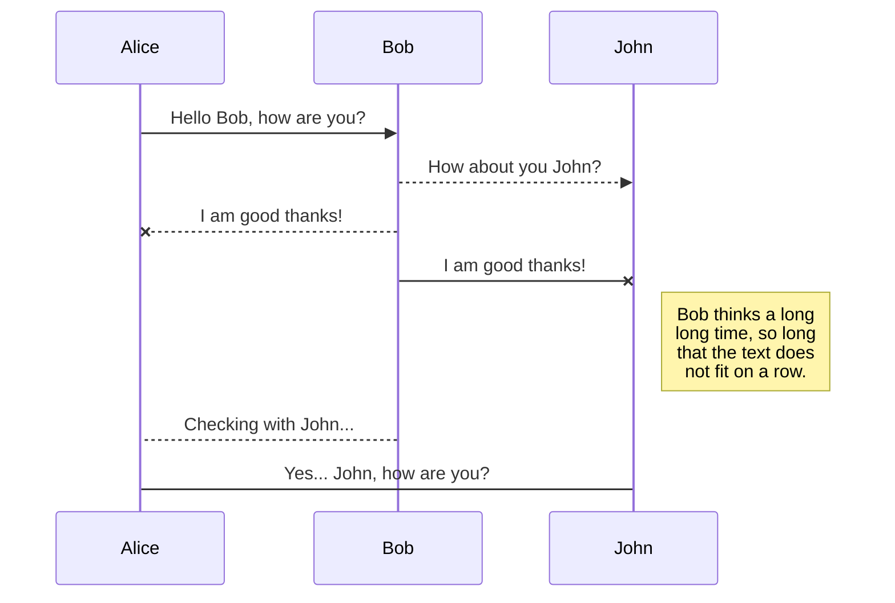
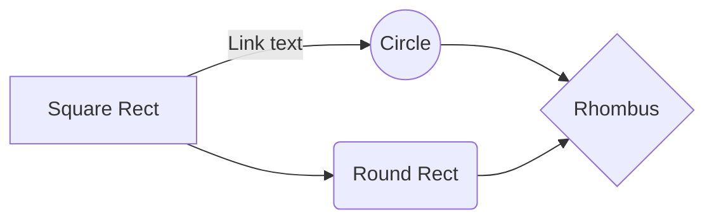

# Bienvenido a nuestro Spin-Off de cartas de League of Legends!

Aquí podrás descubrir otra forma de jugar a este maravilloso juego, saliendo de casa y de tus pantallas. Gracias a nuestras **nuevas cartas,** podéis jugar en cualquier lugar.
¡Ademas puedes mejorar tu experiencia con nuestra nueva aplicación **League of Cards**, permitiéndote ver tus campeones favoritos en **3D luchando en el propio tablero**!

## Tus campeones, en tu mano.

StackEdit stores your files in your browser, which means all your files are automatically saved locally and are accessible **offline!**

## Interfaz

The file explorer is accessible using the button in left corner of the navigation bar. You can create a new file by clicking the **New file** button in the file explorer. You can also create folders by clicking the **New folder** button.

## Última Tecnología

Utilizamos la tecnologia **AR** para mostrar los personajes en realidad aumentada. Notarás que Te emo está poniendo setas al lado tuyo!

 ***Insertar Foto*
Por otro lado hemos incorporado **Fuse** en nuestra aplicación móvil. Siéntete como en casa con un entorno inspirado en el mismísimo **League of Legends**.

***Insertar Foto

## Nuestro equipo

Contamos con un equipo de **4 desarrolladores** experimentados tanto en el mundo de los Videojuegos, como en investigación tecnológica. 

|                |EQUIPO                          |ROLES                        |
|----------------|-------------------------------|-----------------------------|
|Javier Barbas|Foto            |            |
|Luis Betancourt         | Foto            |            |
|Mario Fernández         | Foto|             |
|Francisco José Labanda  | Foto|                |

## Nuestras Plataformas

Puedes descubrir todo el contenido en [GitHub League of Cards](https://github.com/marferfer/SpinOff-LoL/)

## UML diagrams

You can render UML diagrams using [Mermaid](https://mermaidjs.github.io/). For example, this will produce a sequence diagram:

And this will produce a flow chart:

